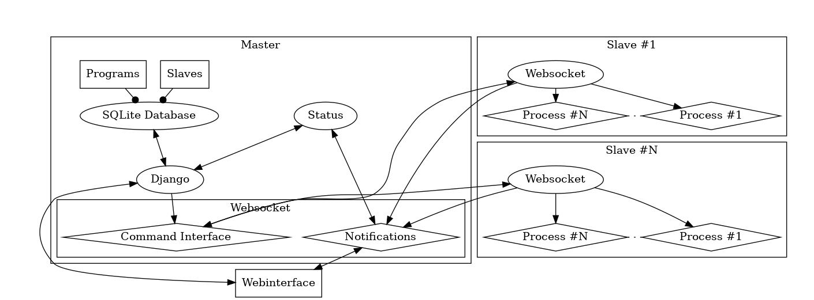

# Anwesende:
Frederik
Jonas
Heiko
Leonardo
Tim
Torben
Jonas

# Besprechung der Userstorys
- Vorstellung von Wake on Lan, Add Program und delete Program
- Vorstellung eines neuen Color-schemes
## Zu Programmen:
- eventueller check ob Programm existiert
## Vorstellung der Architektur anhand des Schaubilds

Beschluss eines Termins zum Testen der Clients

Programme hinzufügen, anzeigen und löschen wurden abgenommen,
Hochfahren eines Rechners soll am Montag getestet werden

# neue Userstorys
## Scripteditor
- Auswahl von allen Programmen, können per Drag and Drop in eine Reihenfolge gezogen wird
- eventuelles hinzufügen von Direktiven (if, run, Schleifen), sleeps
- sollen gut wartbar sein
- Reihenfolge muss festlegbar sein
- Dateien kopieren wird benötigt
- Zuerst Scriptfiles erstellen und dann wenn möglich darauf einen Editor aufbauen

## Startseite
- Scripte sollen auswählbar sein
- Nach 30 Sekunden Autostart->Standardscript/letztes Script
- Standardscript soll mit einem Haken gekennzeichnet sein

## Files
- Files sollen im Script festgelegt werden können
- Eventuell beim Start erst alle .xpl Dateien + scenery im Plugins Ordner entfernen
- Flugzeugwahl soll auch möglich sein
### Attribute
- Es gibt Plugins und sceneries
- Plugins haben eine festgelegte Endung (.xpl)
- Bei sceneries muss der Name beim Kopieren auf einen Defaultname geändert werden.

### Aktionen
- Kopieren, muss dabei bei Plugins die Zieldatei komplett ersetzen.
- Kompliziert, da bestimmte Plugins immer vorhanden sein müssen, andere nicht gleichzeitig aktiv sein dürfen.
- Manuelles Kopieren außerhalb eines Scriptes sollen auch möglich sein.

# Userstorys für nächste Iteration
- Files verschieben
- Programmdetails editieren
- Files anzeigen
- Files löschen
- Files erstellen
- Filedetails editieren
- Herunterfahren des Rechners

# Anmerkungen

# nächste Treffen
- Montag 18.12. Treffen zum Testen der Clients
- Testen, ob Xplane gelinkte Dateien erkennt
- Reguläres Treffen 8.1. 13:00
